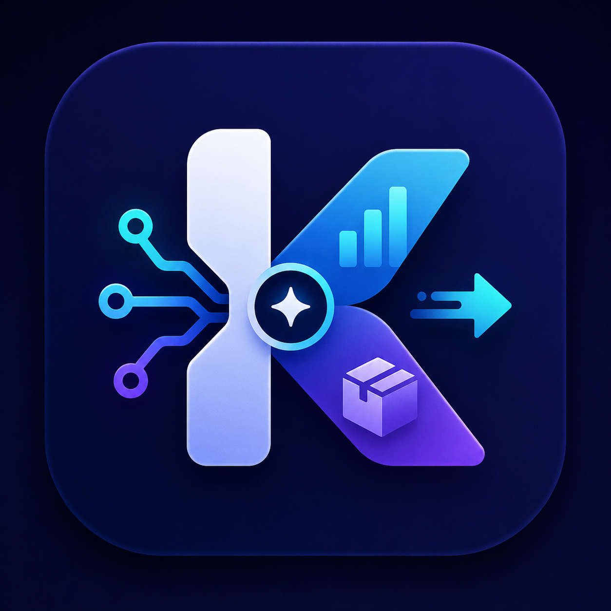

# KAMI — Knowledgeable Agent for Medusa Intelligence

<p align="center">
  
</p>

<p align="center">
  <strong>AI Agent Harness Embedded in Medusa</strong><br>
  An autonomous commerce agent that queries, analyzes, drafts, and acts on your store — directly inside the Medusa admin dashboard.
</p>

<p align="center">
  <a href="#installation"><strong>Installation</strong></a> ·
  <a href="#quick-start"><strong>Quick Start</strong></a> ·
  <a href="#architecture"><strong>Architecture</strong></a> ·
  <a href="#tools--capabilities"><strong>Tools</strong></a> ·
  <a href="#api-routes"><strong>API</strong></a> ·
  <a href="#configuration"><strong>Configuration</strong></a> ·
  <a href="#testing"><strong>Testing</strong></a>
</p>

---

## Overview

KAMI is a DeepSeek-powered AI agent that lives inside your Medusa admin dashboard. It can query every corner of your store — products, orders, customers, inventory, fulfillments, payments — cross-reference the data, and take action. It drafts promotions, creates purchase orders, builds dashboards, and runs on a cron schedule. All through natural language, in Vietnamese or English.

KAMI is not a chatbot bolted onto Medusa. It is a native Medusa module with its own database models, API routes, background jobs, admin UI extensions, and a streaming runtime. It follows Medusa conventions end-to-end: decorator-based services, workflow composition, typed routes, and the admin SDK widget system.

**Key capabilities:**

- **Multi-tool reasoning** — orchestrates 25+ Medusa API tools across products, orders, customers, inventory, fulfillments, payments, shipping, taxes, and more
- **Autonomous execution** — runs independently of frontend connections; generation continues in the background, resumable from any tab
- **Streaming chat** — resumable SSE with incremental text, reasoning visibility, and execution trace
- **Structured artifacts** — dashboards with KPI cards, tables, charts, and commerce-specific cards rendered incrementally during generation
- **Approval gate** — Hermes-style layered security (once/session/always scope) with inline approval cards and configurable timeout
- **Commerce drafts** — LLM-generated promotions, purchase orders, email campaigns, and notes that stay pending until you approve
- **Cron jobs** — scheduled autonomous turns with cron expressions, run history, and auto-repair for stale session references
- **Voice input** — OpenAI Realtime API integration with WebSocket streaming and transcription fallback
- **Memory** — embedding-based vector memory with cosine similarity search and dialectic contradiction detection
- **Multi-channel gateways** — Discord, Slack, and Telegram bots that forward messages to KAMI sessions
- **Sandbox** — optional Docker-based code execution for `code_exec` tool

---

## Installation

### Prerequisites

- **Node.js** >= 20
- **PostgreSQL** 16
- **Redis** 7
- **Docker** (optional, for sandbox code execution)
- **DeepSeek API key** ([platform.deepseek.com](https://platform.deepseek.com))
- **OpenAI API key** (optional, for voice transcription)

### 1. Clone and install

```bash
cd kami-app
yarn install
```

### 2. Start infrastructure

```bash
docker compose up -d
```

This starts PostgreSQL on port `5433` and Redis on port `6380`.

### 3. Configure environment

```bash
cp .env.example .env
```

Edit `.env` and set at minimum:

```bash
DEEPSEEK_API_KEY=sk-your-deepseek-key
JWT_SECRET=a-random-secret-string
COOKIE_SECRET=another-random-secret
```

### 4. Run migrations

```bash
yarn db:migrate
```

### 5. Seed data (optional)

```bash
npx medusa exec ./src/scripts/seed-hardware-store.ts
```

Seeds a realistic Vietnamese hardware supply store: 39 products across 17 categories (hex bolts, screws, anchors, nuts, washers, threaded rods), 35 B2B customers (construction companies, hardware stores, machine shops, contractors, interior designers), and 80 orders across 180 days.

Use `-- --reset` to re-seed from scratch.

### 6. Create admin user

```bash
npx medusa exec ./src/scripts/update-admin-account.ts
```

### 7. Start development

```bash
yarn dev
```

The admin dashboard opens at `http://localhost:9000/app`. KAMI is accessible from the sidebar navigation.

---

## Quick Start

Once the admin dashboard is running, open the KAMI page and try:

> Phan tich tong the cua hang: top 10 san pham ban chay, ton kho sap het, cac don hang dang pending, va khach hang VIP lau khong mua. Tao dashboard.

KAMI will:

1. Call `listProducts` + `listOrders` + `getInventory` + `listCustomers` + `listFulfillments`
2. Cross-reference: inventory vs. orders (dead stock), customers vs. orders (lapsed VIPs)
3. Build a dashboard incrementally via `render_artifact` (KPI cards, charts, tables, action list)
4. Suggest follow-up quick actions as clickable buttons

Click any suggested action to execute it directly. KAMI runs the tool and then automatically follows up with analysis and next steps.

---

## Architecture

```
┌─────────────────────────────────────────────────────────────────┐
│                    MEDUSA ADMIN DASHBOARD                        │
│  ┌──────────────────────────────────────────────────────────┐  │
│  │                    KAMI PAGE (React)                       │  │
│  │  ┌────────────┐  ┌──────────────┐  ┌──────────────────┐  │  │
│  │  │ Chat Area   │  │ Artifact     │  │ Admin Drawer     │  │  │
│  │  │ • Messages  │  │ Panel        │  │ • Approvals      │  │  │
│  │  │ • Streaming │  │ • KPIs       │  │ • Audit          │  │  │
│  │  │ • Trace     │  │ • Tables     │  │ • Memory         │  │  │
│  │  │ • Actions   │  │ • Charts     │  │ • Cron           │  │  │
│  │  └────────────┘  └──────────────┘  │ • Gateways       │  │  │
│  │                                     │ • Skills         │  │  │
│  │  ┌──────────────────────────────┐   │ • Settings       │  │  │
│  │  │ Session Sidebar (spinner)    │   └──────────────────┘  │  │
│  │  └──────────────────────────────┘                          │  │
│  └──────────────────────────────────────────────────────────┘  │
│                          │ SSE / HTTP                           │
└──────────────────────────┼─────────────────────────────────────┘
                           │
┌──────────────────────────┼─────────────────────────────────────┐
│                    KAMI RUNTIME (server)                         │
│                                                                  │
│  ┌───────────────────────────────────────────────────────────┐ │
│  │                     run-turn.ts                             │ │
│  │  LLM loop: call tools → yield events → AI sees results     │ │
│  │  • ApprovalGate v2 (blocking Promise, Hermes-style)        │ │
│  │  • StreamManager (resumable SSE with event buffer)         │ │
│  │  • ActiveLoops (halt/abort per session)                    │ │
│  │  • Context compression (token budget management)           │ │
│  └───────────────────────────────────────────────────────────┘ │
│                                                                  │
│  ┌──────────┐  ┌──────────┐  ┌──────────┐  ┌───────────────┐  │
│  │ Provider │  │ Security │  │  Tools   │  │   Reporting    │  │
│  │ DeepSeek │  │ Approval │  │ 25+ tools│  │ Artifact build │  │
│  │ Health   │  │ Autonomy │  │ Dispatch │  │ Quick actions  │  │
│  │ Fallback │  │ Audit    │  │ Validate │  │ Templates      │  │
│  └──────────┘  └──────────┘  └──────────┘  └───────────────┘  │
│                                                                  │
│  ┌──────────┐  ┌──────────┐  ┌──────────┐  ┌───────────────┐  │
│  │  Memory  │  │  Voice   │  │ Gateways │  │   Sandbox     │  │
│  │ Embedding│  │ OpenAI   │  │ Discord  │  │ Docker exec   │  │
│  │ Dialectic│  │ Realtime │  │ Slack    │  │ Timeout 30s   │  │
│  │ Postgres │  │ WebSocket│  │ Telegram │  │ Read-only fs  │  │
│  └──────────┘  └──────────┘  └──────────┘  └───────────────┘  │
│                                                                  │
│  ┌───────────────────────────────────────────────────────────┐ │
│  │                 Background Jobs                             │ │
│  │  • kami-cron-tick (every minute, cron expression scheduler)│ │
│  │  • kami-background-review (autonomous store health check)  │ │
│  └───────────────────────────────────────────────────────────┘ │
│                                                                  │
│  ┌───────────────────────────────────────────────────────────┐ │
│  │                 KAMI Module (database)                      │ │
│  │  Sessions · Messages · Memories · Skills · Jobs ·         │ │
│  │  Approvals · Artifacts · Audit Logs · Report Templates    │ │
│  └───────────────────────────────────────────────────────────┘ │
└──────────────────────────────────────────────────────────────────┘
```

### Streaming Flow

```
Browser                          Server                         LLM
  │                                │                              │
  │── POST /chat/start ──────────▶│                              │
  │◀─ { streamId, sessionId } ────│                              │
  │                                │                              │
  │── GET /chat/stream/:id ──────▶│                              │
  │                                │── runTurn() ───────────────▶│
  │◀─ SSE: text_delta ────────────│◀─ text chunk ────────────────│
  │◀─ SSE: tool_call ─────────────│── dispatch tool ────────────▶│
  │◀─ SSE: tool_result ───────────│◀─ tool result ───────────────│
  │◀─ SSE: approval_required ─────│── (pause, wait for user) ────│
  │                                │◀─ user approve via API ──────│
  │◀─ SSE: artifact_delta ────────│── render_artifact ───────────│
  │◀─ SSE: quick_actions ─────────│                              │
  │◀─ SSE: done ──────────────────│                              │
  │                                │                              │
  │  (tab closed — generation continues in background)           │
  │                                │                              │
  │── GET /chat/stream/:id?resume ▶│                              │
  │◀─ SSE: sync (all past events) ─│                              │
  │◀─ SSE: live events continue ───│                              │
```

Key properties:

- **Resumable**: close the tab, reopen, reconnect — all past events replay, then live events continue
- **Independent generation**: the `runTurn()` generator runs on a worker thread; SSE connection close does NOT stop generation
- **Explicit stop only**: clicking the Stop button calls `DELETE /chat/stream/:id` → `ActiveLoops.halt(sessionId)` → LLM abort
- **Idempotent start**: `POST /chat/start` returns the existing `streamId` if a generation is already active for the session

### Module Data Model

KAMI persists its state through a native Medusa module (`src/modules/kami/`) with 9 entity models:

| Model | Purpose |
|---|---|
| `KamiSession` | Conversation thread with title, category, tags, status |
| `KamiMessage` | Individual messages with role, content, content_parts (tool calls, think blocks, traces) |
| `KamiSkill` | Curated prompt templates with toolset assignments and risk levels |
| `KamiMemory` | Embedding-indexed facts with cosine similarity search and dialectic review |
| `KamiJob` | Cron-scheduled autonomous turns with cron expressions and run history |
| `KamiAuditLog` | Immutable audit trail of every tool execution with risk level and result summary |
| `KamiApproval` | Pending approval requests with scope, timeout, and decision tracking |
| `KamiArtifact` | Structured reports (dashboards) with typed sections and export support |
| `KamiReportTemplate` | Reusable report definitions with schedule presets |

---

## Tools & Capabilities

### Commerce Tools (25+)

All Medusa Admin API operations are exposed to the LLM as typed function tools:

| Domain | Tools |
|---|---|
| **Products** | `listProducts`, `getProduct`, `createProduct`, `updateProduct`, `deleteProduct` |
| **Orders** | `listOrders`, `getOrder`, `createOrder`, `cancelOrder`, `archiveOrder` |
| **Customers** | `listCustomers`, `getCustomer`, `createCustomer`, `updateCustomer` |
| **Inventory** | `listInventoryItems`, `getInventoryItem`, `getInventory`, `adjustInventory` |
| **Fulfillments** | `listFulfillments`, `createFulfillment`, `cancelFulfillment` |
| **Payments** | `listPayments`, `capturePayment`, `refundPayment` |
| **Drafts** | `listDraftOrders`, `getDraftOrder`, `createDraftOrder` |
| **Shipping** | `listShippingOptions`, `listShippingProfiles` |
| **Stock** | `listStockLocations`, `listFulfillmentSets`, `listServiceZones` |
| **Pricing** | `listPriceLists`, `listPromotions`, `createPromotion` |
| **Categories** | `listCategories`, `createCategory` |
| **Collections** | `listCollections`, `createCollection` |
| **Customers** | `listCustomerGroups`, `manageCustomerGroup` |
| **Tax** | `listTaxRates`, `listTaxRegions` |
| **Store** | `getStore`, `updateStore` |
| **Claims/Exchanges/Returns** | `listClaims`, `listExchanges`, `listReturns` |

Every tool has a risk level: `read`, `safe`, `mutating`, or `destructive`. Destructive tools (`deleteProduct`, `cancelOrder`, `refundOrder`) always require approval.

### Meta Tools

| Tool | Purpose |
|---|---|
| `render_artifact` | Build structured dashboards incrementally: KPI cards, tables, charts, commerce cards, action lists |
| `suggest_action` | Propose follow-up actions as clickable buttons in chat |
| `call_api` | Generic Medusa API caller for operations not covered by typed tools |
| `api_catalog` | Discover available Medusa API endpoints at runtime |

### General Tools

| Tool | Purpose |
|---|---|
| `read_file` | Read files from the server filesystem |
| `write_file` | Write files (within allowed paths) |
| `list_files` | List directory contents |
| `web_fetch` | Fetch a URL and return markdown |
| `web_search` | Search the web |
| `terminal` | Execute shell commands |

---

## API Routes

All routes are prefixed with `/admin/kami` and require authentication.

### Chat & Streaming

| Method | Route | Description |
|---|---|---|
| `POST` | `/chat` | Legacy unified chat (POST + SSE response) |
| `POST` | `/chat/start` | Create generation job, returns `{ streamId }`. Idempotent — returns existing job if active |
| `GET` | `/chat/stream/:streamId` | SSE stream for a generation job. Supports `?resume=true` for reconnection |
| `DELETE` | `/chat/stream/:streamId` | Abort generation and halt the LLM loop |
| `GET` | `/chat/stream-status/:sessionId` | Check whether a session has an active generation |

### Sessions

| Method | Route | Description |
|---|---|---|
| `GET` | `/sessions` | List all sessions |
| `GET` | `/sessions/:id` | Get session details |
| `GET` | `/sessions/:id/messages` | Get messages for a session |

### Approvals

| Method | Route | Description |
|---|---|---|
| `GET` | `/approvals` | List pending approvals |
| `POST` | `/approvals/:id/decide` | Approve or reject with scope (`once`, `session`, `always`) |

### Actions

| Method | Route | Description |
|---|---|---|
| `POST` | `/actions` | Execute a tool directly (for quick action buttons) |

### Memory

| Method | Route | Description |
|---|---|---|
| `GET` | `/memory` | List memories |
| `GET` | `/memory/search` | Semantic search with cosine similarity |
| `GET` | `/memory/:id` | Get single memory |
| `POST` | `/memory` | Create memory |
| `PUT` | `/memory/:id` | Update memory |
| `DELETE` | `/memory/:id` | Delete memory |

### Skills

| Method | Route | Description |
|---|---|---|
| `GET` | `/skills` | List skills |
| `GET` | `/skills/:id` | Get skill details |

### Cron Jobs

| Method | Route | Description |
|---|---|---|
| `GET` | `/cron` | List cron jobs |
| `GET` | `/cron/:id` | Get cron job details |
| `POST` | `/cron` | Create cron job |
| `PUT` | `/cron/:id` | Update cron job |
| `DELETE` | `/cron/:id` | Delete cron job |
| `POST` | `/cron/preview` | Preview next run times for a cron expression |

### Artifacts & Reports

| Method | Route | Description |
|---|---|---|
| `GET` | `/reports` | List artifacts |
| `POST` | `/reports/:id/export` | Export artifact as CSV or Markdown |
| `GET` | `/report-templates` | List report templates |
| `POST` | `/report-templates/:id/run` | Execute a report template |

### Drafts

| Method | Route | Description |
|---|---|---|
| `GET` | `/drafts` | List drafts |
| `GET` | `/drafts/:id` | Get draft details |
| `POST` | `/drafts/:id/execute` | Execute a commerce draft |
| `DELETE` | `/drafts/:id` | Dismiss a draft |

### Admin

| Method | Route | Description |
|---|---|---|
| `GET` | `/audit` | List audit logs |
| `GET` | `/autonomy` | Get autonomy config |
| `PUT` | `/autonomy` | Update autonomy config |
| `GET` | `/settings` | Get KAMI settings |
| `PUT` | `/settings` | Update KAMI settings |
| `GET` | `/health` | Health check (DeepSeek connectivity, DB status) |
| `POST` | `/halt` | Halt all active generations |
| `GET` | `/evals` | Run evaluation harness |
| `GET` | `/dashboard-suggestions` | Get dashboard suggestions |

### Voice / ASR

| Method | Route | Description |
|---|---|---|
| `GET` | `/asr/config` | Get voice/ASR configuration |
| `GET` | `/asr/realtime-ticket` | Get WebSocket ticket for OpenAI Realtime |
| `POST` | `/asr/transcribe` | Transcribe audio file |

### Gateways

| Method | Route | Description |
|---|---|---|
| `GET` | `/gateways` | List gateway configurations |
| `POST` | `/gateways/discord` | Configure Discord gateway |
| `POST` | `/gateways/slack` | Configure Slack gateway |
| `POST` | `/gateways/telegram` | Configure Telegram gateway |

---

## Configuration

All configuration is via environment variables (see `.env.example` for the full list).

### Required

| Variable | Description |
|---|---|
| `DEEPSEEK_API_KEY` | DeepSeek API key |
| `DEEPSEEK_BASE_URL` | DeepSeek API base URL (default: `https://api.deepseek.com`) |
| `DATABASE_URL` | PostgreSQL connection string |
| `REDIS_URL` | Redis connection string |
| `JWT_SECRET` | JWT signing secret |
| `COOKIE_SECRET` | Cookie signing secret |

### Model

| Variable | Default | Description |
|---|---|---|
| `KAMI_MODEL` | `deepseek-v4-pro` | Model ID for chat completions |
| `KAMI_FALLBACK_MODEL` | `deepseek-chat` | Fallback model on failure |
| `KAMI_REASONING_EFFORT` | `high` | Reasoning effort level |
| `KAMI_THINKING` | `true` | Enable thinking/CoT blocks |

### Runtime Guards

| Variable | Default | Description |
|---|---|---|
| `KAMI_MAX_ITERATIONS` | `25` | Maximum tool-calling iterations per turn |
| `KAMI_MAX_TOKENS_PER_TURN` | `60000` | Token budget per turn |
| `KAMI_CONTEXT_LIMIT` | `128000` | Context window size |
| `KAMI_APPROVAL_REQUIRED` | `true` | Enable the approval gate |
| `KAMI_DESTRUCTIVE_TOOLS` | `delete_product,cancel_order,refund_order` | Tools that always require approval |
| `KAMI_HALT` | `false` | Global halt switch |
| `KAMI_MAX_RETRIES` | `3` | Max retries on transient failures |
| `KAMI_RETRY_DELAY_MS` | `1000` | Delay between retries |

### Voice (OpenAI)

| Variable | Description |
|---|---|
| `OPENAI_API_KEY` | OpenAI API key for voice transcription |
| `KAMI_VOICE_MODEL` | Realtime voice model (default: `gpt-realtime-2`) |
| `KAMI_TRANSCRIBE_MODEL` | Transcription model (default: `gpt-4o-transcribe`) |
| `KAMI_VOICE_WS_PORT` | WebSocket port for realtime voice (default: `9901`) |

### Gateways

| Variable | Description |
|---|---|
| `KAMI_GATEWAY_TELEGRAM_TOKEN` | Telegram bot token |
| `KAMI_GATEWAY_TELEGRAM_SECRET` | Telegram webhook secret |
| `KAMI_GATEWAY_DISCORD_TOKEN` | Discord bot token |
| `KAMI_GATEWAY_DISCORD_PUBLIC_KEY` | Discord public key |
| `KAMI_GATEWAY_SLACK_TOKEN` | Slack bot token |
| `KAMI_GATEWAY_SLACK_SIGNING_SECRET` | Slack signing secret |

### Sandbox

| Variable | Default | Description |
|---|---|---|
| `KAMI_SANDBOX_ENABLED` | `false` | Enable Docker sandbox |
| `KAMI_SANDBOX_IMAGE` | `alpine:3.20` | Docker image |
| `KAMI_SANDBOX_TIMEOUT_MS` | `30000` | Execution timeout |
| `KAMI_SANDBOX_MEMORY_MB` | `128` | Memory limit |
| `KAMI_SANDBOX_NETWORK` | `false` | Allow network access |
| `KAMI_SANDBOX_READONLY` | `true` | Read-only filesystem |

### Memory

Memory uses the same DeepSeek API key for embeddings. When the embedding API is unavailable, it falls back to a hash-based vector for graceful degradation.

---

## Security Model

### Risk-Based Tool Classification

Every tool has a risk level:

| Level | Description | Requires Approval |
|---|---|---|
| `read` | Read-only queries (list, get) | Never |
| `safe` | Non-destructive writes (create artifact, suggest action) | Never |
| `mutating` | Data-modifying operations (create order, update customer) | Configurable |
| `destructive` | Irreversible operations (delete, cancel, refund) | Always |

### Approval Gate v2

Modeled after the Hermes Agent pattern. When the LLM calls a tool that requires approval:

1. The turn **pauses** (does not end) — subsequent tool calls are not skipped
2. An `approval_required` SSE event is emitted
3. An inline `ApprovalCard` renders in the chat with: tool name, args preview, risk badge, Approve/Reject buttons
4. The user selects a **scope**: `Once` (this call only), `This session` (all matching calls this session), or `Always` (persist to config)
5. The server resolves the blocking Promise → the LLM turn continues where it left off
6. All tool results (before and after the approval) are visible to the LLM in the same turn

**Timeout**: 120 seconds. After timeout, the approval auto-rejects with a diagnostic message.

### Autonomy Levels

| Level | Behavior |
|---|---|
| `supervised` | All mutating/destructive tools require approval |
| `semi-autonomous` | Mutating tools auto-approved; destructive still require approval |
| `autonomous` | All tools auto-approved |

### Audit Trail

Every tool execution is logged to `KamiAuditLog` with: session ID, tool name, arguments, result summary, risk level, and actor identity. Logs are immutable and queryable through the Admin Drawer > Audit tab.

---

## Frontend Architecture

### Component Tree

```
page.tsx (main orchestrator, ~2700 lines post-split)
├── SessionSidebar          — Session list with spinner indicators
├── ChatArea
│   ├── ChatMessageBubble   — User/assistant/tool messages
│   │   ├── KamiMarkdown    — Markdown renderer (react-markdown + remark-gfm)
│   │   ├── ExecutionTrace  — Collapsible tool execution trace
│   │   ├── ApprovalCard    — Inline approval request (approve/reject + scope)
│   │   └── QuickActionCards — Clickable follow-up action buttons
│   ├── AssistantLoading    — Thinking indicator with animated dots
│   ├── WelcomeState        — Welcome screen with skill suggestions
│   └── ChatInput           — Text input + voice button + send/stop
├── ArtifactPanel           — Right-side panel with slide animation
│   ├── KPI cards           — Metric grid
│   ├── Data tables         — Sortable tables
│   ├── Bar charts         — Horizontal bar chart renderer
│   └── Export tab          — CSV / Markdown download
├── DraftPanel              — Commerce draft editor
├── UiCommandPanel          — UI command renderer
└── AdminDrawer             — Multi-tab admin panel
    ├── Approvals tab       — Pending approval management
    ├── Audit tab           — Execution audit log viewer
    ├── Memory tab          — Memory CRUD + semantic search
    ├── Skills tab          — Skill template management
    ├── Cron tab            — Cron job CRUD + schedule preview
    ├── Gateways tab        — Discord/Slack/Telegram configuration
    └── Settings tab        — Autonomy level + evaluation settings
```

### State Management

React Context + `useReducer` pattern via `kami-store.tsx`. Single `KamiState` type with 25+ action types. No external state library required.

### Streaming Hook

`useKamiChat.ts` provides:

- `send(text, sessionId)` — start a new turn
- `connect(streamId, sessionId)` — resume an existing stream
- `checkAndResume(sessionId)` — poll `/chat/stream-status` and auto-reconnect
- Auto-reconnect with exponential backoff (1s, 2s, 4s, 8s, 16s, max 5 attempts)
- Cleanup on unmount closes local SSE but does NOT abort server generation

---

## Background Jobs

### `kami-cron-tick`

Runs every minute. Evaluates all enabled cron jobs and executes any that are due.

Features:
- Full 5-field cron expression parser (minute, hour, day-of-month, month, day-of-week)
- Shorthand support: `@hourly`, `@daily`, `every N minutes/hours/days`
- `*/N` step syntax
- Run history (last 20 runs with duration, status, artifact ID)
- Auto-repair of stale `session_id` references (when original session was deleted)
- Audit logging for every execution

### `kami-background-review`

Runs daily. Autonomous store health check: inventory levels, pending orders, customer churn risk. Generates a report artifact and stores it for review.

---

## Testing

### Unit Tests

```bash
yarn test:kami-unit
```

33 tests across 3 suites:

| Suite | Tests | Coverage |
|---|---|---|
| `stream-manager.test.ts` | 22 | Job lifecycle, event buffering, subscriber notification, resume replay, TTL cleanup, active job discovery |
| `approval-gate-v2.test.ts` | 12 | Request creation, decision resolution, session-scope caching, timeout auto-reject, always-scope persistence |
| `artifact-builder.test.ts` | 12 | Section merging, incremental updates, create/append/replace/update_section actions, schema validation |

### Smoke Test (Mock LLM)

```bash
yarn test:kami-smoke
```

Runs a turn with a mock LLM that returns tool calls. Validates the full dispatch pipeline without consuming API credits.

### E2E Test (Real DeepSeek)

```bash
yarn test:kami-e2e
```

End-to-end test against the real DeepSeek API. Validates the complete run-turn loop with actual tool execution.

### DeepSeek Connectivity

```bash
yarn test:deepseek
```

Zero-dependency connectivity test using Node 20+ native `fetch`.

### Evaluation Suite

```bash
yarn test:kami-eval
```

Runs a set of predefined scenarios and scores the model's tool selection accuracy, argument correctness, and response quality.

---

## Development

### Directory Layout

```
kami-app/
├── src/
│   ├── admin/                  # Admin UI
│   │   ├── hooks/              # React hooks
│   │   ├── routes/kami/        # KAMI page + components + store
│   │   └── widgets/            # Admin zone injections
│   ├── api/admin/kami/         # API routes (35+ endpoints)
│   ├── kami-runtime/           # Core agent runtime
│   │   ├── loop/               # Turn execution, streaming, event loop
│   │   ├── tools/              # Tool registry, dispatch, 25+ tools
│   │   ├── security/           # Approval gate, audit, autonomy
│   │   ├── report/             # Artifact builder, quick actions, templates
│   │   ├── memory/             # Embedding, dialectic, cosine search
│   │   ├── prompt/             # System prompt builder
│   │   ├── provider/           # DeepSeek client + healthcheck
│   │   ├── voice/              # OpenAI Realtime + transcription
│   │   ├── gateways/           # Discord, Slack, Telegram
│   │   ├── sandbox/            # Docker-based code execution
│   │   ├── skills/             # Skill loader + improvement
│   │   └── __tests__/          # Unit tests
│   ├── jobs/                   # Background scheduled jobs
│   ├── modules/kami/           # Medusa module (models, service, migrations)
│   ├── policies/               # Access control policies
│   └── scripts/                # Seed, smoke, E2E, admin utils
├── medusa-config.ts            # Medusa framework configuration
├── docker-compose.yml          # PostgreSQL + Redis
├── .env.example                # Environment variable template
└── package.json
```

### Code Conventions

- **TypeScript**: Target ES2021, Module Node16, strict null checks
- **Formatting**: No semicolons, double quotes, 2-space indentation, ES5 trailing commas
- **Naming**: kebab-case files, PascalCase types/classes, camelCase functions/variables
- **Exports**: Barrel exports via `export * from`
- **Medusa patterns**: Decorator-based services (`@InjectManager`, `@MedusaContext`, `@EmitEvents`), workflow composition, typed routes

### Path Aliases

Configured in `tsconfig.json`:

| Alias | Path |
|---|---|
| `@models` | `./src/modules/kami/models` |
| `@services` | `./src/modules/kami/services` |
| `@types` | `./src/modules/kami/types` |
| `@repositories` | `./src/modules/kami/repositories` |
| `@kami/config` | `./src/kami-runtime/config` |
| `@kami/report/*` | `./src/kami-runtime/report/*` |
| `@kami/security/*` | `./src/kami-runtime/security/*` |
| `@kami/tools/*` | `./src/kami-runtime/tools/*` |
| `@kami/runtime/*` | `./src/kami-runtime/*` |

---

## License

MIT — see the root [LICENSE](../LICENSE) file.

---

## Related

- [Medusa](https://medusajs.com) — The open-source commerce platform KAMI is built on
- [DeepSeek](https://platform.deepseek.com) — The LLM powering KAMI's reasoning
- [Hermes Agent](https://github.com/daovinhkhang/hermes-agent) — Reference architecture for the approval gate pattern
- [LibreChat](https://github.com/danny-avila/LibreChat) — Reference architecture for resumable SSE streaming
